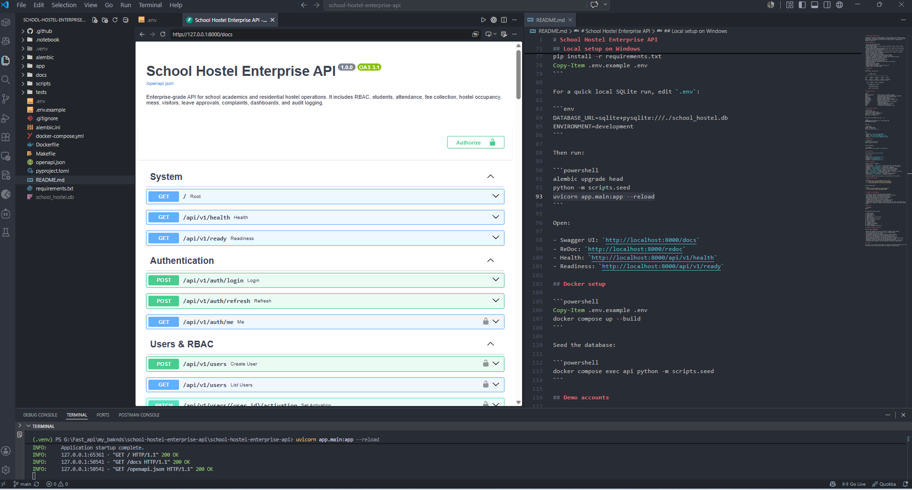

# School Hostel Enterprise API

A production-oriented **FastAPI backend for school academics and residential hostel operations**. The project is implemented as a modular monolith so it can be deployed easily today and separated into services later when traffic or organizational boundaries require it.


## Core capabilities

- JWT access and refresh tokens
- Argon2 password hashing
- Nine-role RBAC: admin, principal, warden, accountant, teacher, guard, student, parent, and mess manager
- Student admission profiles, guardians, medical notes, grade and section mapping
- Academic grades and attendance records
- Fee invoices, partial/full payments, due-state calculation, unique transaction references, and collection summary
- Hostel buildings, rooms, automatically generated beds, occupancy, allocation, checkout, and gender-policy validation
- Mess plans and student subscriptions
- Visitor check-in/check-out and active visitor register
- Student leave applications and warden approval workflow
- Complaint, maintenance, assignment, priority, and resolution workflow
- Management dashboard and occupancy analytics
- Audit logs for sensitive write actions
- Standard validation and HTTP error envelopes
- Request IDs and processing-time headers
- PostgreSQL production configuration and SQLite local fallback
- Alembic migrations
- Redis/Celery worker examples
- Docker Compose environment
- Automated end-to-end tests and GitHub Actions CI
- Swagger, ReDoc, and OpenAPI JSON

## Architecture

```text
Web / Mobile / Admin Portal
            |
            v
       FastAPI Gateway
            |
  +---------+----------+-----------+----------+
  |         |          |           |          |
Auth     Students   Academics    Finance    Hostel
  |         |          |           |          |
RBAC    Guardians  Attendance   Payments  Rooms/Beds
  +---------+----------+-----------+----------+
            |
   Mess / Visitors / Leave / Complaints
            |
      SQLAlchemy Unit of Work
            |
        PostgreSQL Database
            |
       Redis + Celery Worker
```

## Project structure

```text
app/
├── api/endpoints/       # HTTP controllers grouped by domain
├── core/                # Configuration, security, dependencies, middleware
├── db/                  # SQLAlchemy engine and declarative base
├── models/              # Relational domain models
├── schemas/             # Pydantic request/response contracts
├── services/            # Reusable domain services and audit writer
├── tasks/               # Celery background tasks
└── main.py              # Application factory and error handling
alembic/                  # Database migrations
scripts/                  # Seed and OpenAPI export scripts
tests/                    # End-to-end lifecycle tests
docs/                     # Architecture and production notes
```

## Local setup on Windows

```powershell
python -m venv .venv
.\.venv\Scripts\Activate.ps1
python -m pip install --upgrade pip
pip install -r requirements.txt
Copy-Item .env.example .env
```

For a quick local SQLite run, edit `.env`:

```env
DATABASE_URL=sqlite+pysqlite:///./school_hostel.db
ENVIRONMENT=development
```

Then run:

```powershell
alembic upgrade head
python -m scripts.seed
uvicorn app.main:app --reload
```

Open:

- Swagger UI: `http://localhost:8000/docs`
- ReDoc: `http://localhost:8000/redoc`
- Health: `http://localhost:8000/api/v1/health`
- Readiness: `http://localhost:8000/api/v1/ready`

## Docker setup

```powershell
Copy-Item .env.example .env
docker compose up --build
```

Seed the database:

```powershell
docker compose exec api python -m scripts.seed
```

## Demo accounts

All seeded accounts use `Password@123`.

| Role          | Email                   |
| ------------- | ----------------------- |
| Administrator | `admin@school.local`    |
| Warden        | `warden@school.local`   |
| Accountant    | `accounts@school.local` |
| Student       | `student@school.local`  |

## Major API groups

| Domain          | Prefix               | Examples                                       |
| --------------- | -------------------- | ---------------------------------------------- |
| Authentication  | `/api/v1/auth`       | Login, refresh token, current profile          |
| Users and roles | `/api/v1/users`      | Create user, list users, activation            |
| Academics       | `/api/v1/academics`  | Grade/section management                       |
| Students        | `/api/v1/students`   | Admission, search, profile update              |
| Attendance      | `/api/v1/attendance` | Bulk mark and filter records                   |
| Fees            | `/api/v1/fees`       | Invoices, payments, collection summary         |
| Hostel          | `/api/v1/hostel`     | Buildings, rooms, beds, allocations, occupancy |
| Mess            | `/api/v1/mess`       | Plans and subscriptions                        |
| Operations      | `/api/v1/operations` | Visitors, leave, complaints                    |
| Administration  | `/api/v1/admin`      | Management dashboard                           |

The generated OpenAPI contract contains **44 operations across 32 paths**.

## Authentication example

```bash
curl -X POST http://localhost:8000/api/v1/auth/login \
  -H "Content-Type: application/x-www-form-urlencoded" \
  -d "username=admin@school.local&password=Password@123"
```

Use the access token:

```bash
curl http://localhost:8000/api/v1/admin/dashboard \
  -H "Authorization: Bearer YOUR_ACCESS_TOKEN"
```

## Database rules implemented

- A student can have only one active hostel allocation.
- An occupied, reserved, or maintenance bed cannot be allocated.
- Hostel gender policy is checked during allocation.
- Room creation automatically creates its bed inventory.
- Checkout releases the bed for the next allocation.
- A transaction reference can be used only once.
- A payment cannot exceed an invoice's outstanding balance.
- Leave requests can be approved or rejected only once.
- Students can submit leave requests or complaints only for their own linked profile.
- Attendance is unique per student and date; repeated submissions update the existing record.

## Run tests

```powershell
pytest
```

The automated lifecycle covers:

1. Authentication
2. Grade creation
3. Student admission
4. Attendance
5. Hostel building and room setup
6. Bed allocation
7. Invoice creation and payment
8. Mess subscription
9. Visitor lifecycle
10. Leave approval
11. Complaint resolution
12. Dashboard verification
13. Hostel checkout
14. Payment idempotency protection

## Production hardening checklist

Before a public deployment:

- Replace the example JWT secret and rotate it through a secret manager.
- Put the API behind TLS and a reverse proxy or managed gateway.
- Restrict CORS to trusted frontends.
- Use managed PostgreSQL with backups and point-in-time recovery.
- Add row-level authorization for parent/student self-service views.
- Integrate a real email/SMS provider through background tasks.
- Add an object-storage adapter for identity documents and receipts.
- Add rate limiting, WAF rules, centralized logs, metrics, traces, and alerting.
- Implement refresh-token revocation and session/device tracking.
- Add payment gateway signature verification before enabling online collections.
- Perform privacy, retention, and local regulatory reviews for student data.

## License

This starter is provided for educational, portfolio, and internal-development use. Add an explicit project license before public or commercial redistribution.
